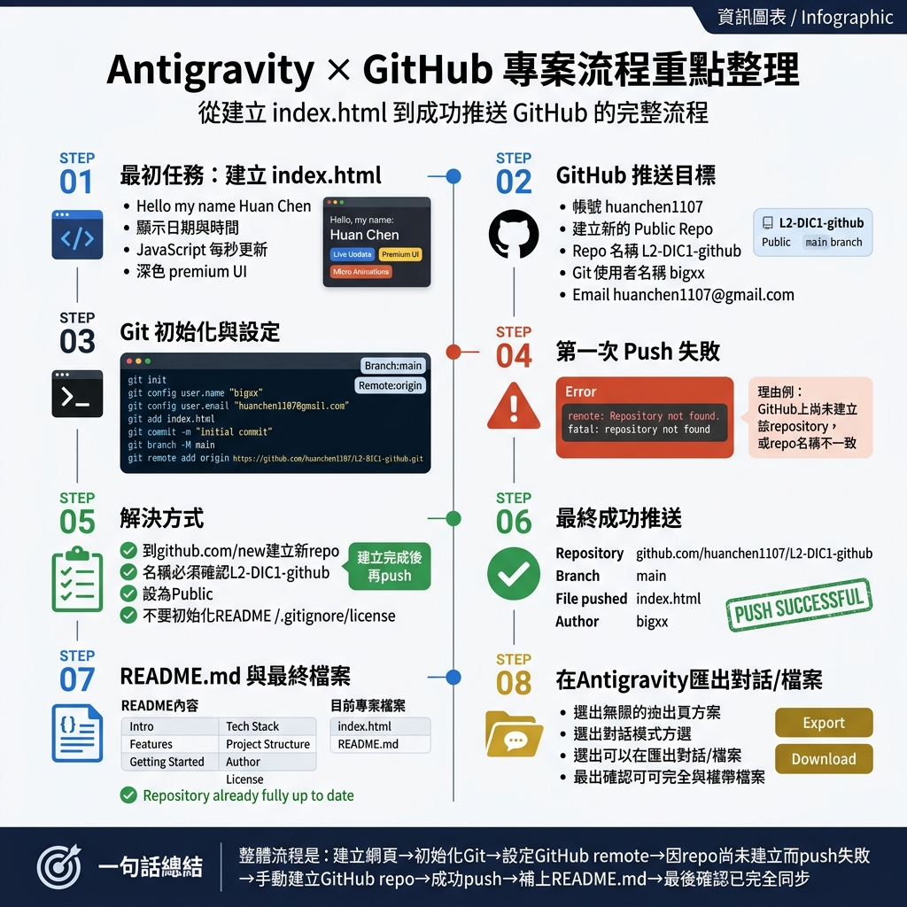

# 工作日誌

**姓名：** 陳煥（Huan Chen）  
**日期：** 2026年5月29日  
**專案：** L2-DIC1-github — 個人介紹網頁開發與部署  

---

## 📊 專案流程總覽



> 上圖為本次作業完整流程的資訊圖表，涵蓋從建立 `index.html` 到成功推送 GitHub 的每個步驟。

---

## 📝 工作紀錄

### Step 01 — 建立 index.html
- 使用純 HTML、CSS、JavaScript 建立個人介紹靜態網頁
- 網頁顯示姓名 **Huan Chen**、即時時鐘（每秒更新）、即時日期
- 採用深色 Premium UI、玻璃態卡片、環境光暈動畫設計

### Step 02 — 設定 GitHub 推送目標
- GitHub 帳號：`huanchen1107`
- 目標 Repo 名稱：`L2-DIC1-github`（Public）
- Git 使用者名稱：`bigxx`
- Email：`huanchen1107@gmail.com`

### Step 03 — Git 初始化與設定
```bash
git init
git config user.name "bigxx"
git config user.email "huanchen1107@gmail.com"
git add index.html
git commit -m "initial commit"
git branch -M main
git remote add origin https://github.com/huanchen1107/L2-DIC1-github.git
```

### Step 04 — 第一次 Push 失敗
- 錯誤訊息：`remote: Repository not found.`
- 原因：GitHub 上尚未建立該 Repository

### Step 05 — 解決方式
- 至 [github.com/new](https://github.com/new) 手動建立新 Repo
- 名稱確認為 `L2-DIC1-github`，設為 **Public**
- 不初始化 README / .gitignore / License

### Step 06 — 最終成功推送 ✅
- Repository：[github.com/huanchen1107/L2-DIC1-github](https://github.com/huanchen1107/L2-DIC1-github)
- Branch：`main`
- File pushed：`index.html`
- Author：`bigxx <huanchen1107@gmail.com>`

### Step 07 — README.md 與最終檔案
- 撰寫完整 README.md，含 Live Demo 連結
- 🔗 **Live Demo：https://huanchen1107.github.io/L2-DIC1-github/**
- Repository 狀態：`already fully up to date`

### Step 08 — 在 Antigravity 匯出對話
- 透過對話面板上方的「...」或「⋮」選單尋找 Export / Download 選項
- 對話紀錄亦可在本機 artifact 資料夾取得

---

## 🏁 一句話總結

> 整體流程是：建立網頁 → 初始化 Git → 設定 GitHub remote → 因 repo 尚未建立而 push 失敗 → 手動建立 GitHub repo → 成功 push → 補上 README.md → 最後確認已完全同步。

---

**報告人：** 陳煥（Huan Chen）  
**完成日期：** 2026年5月29日
